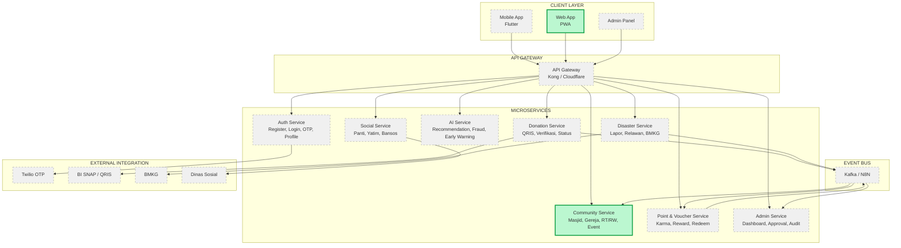
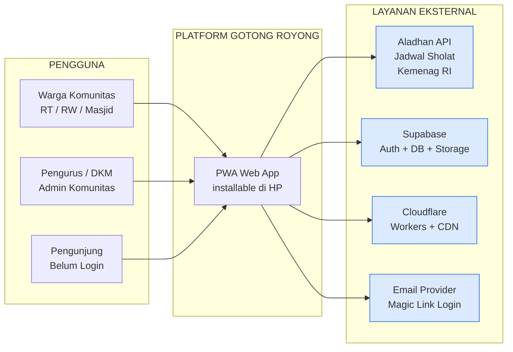
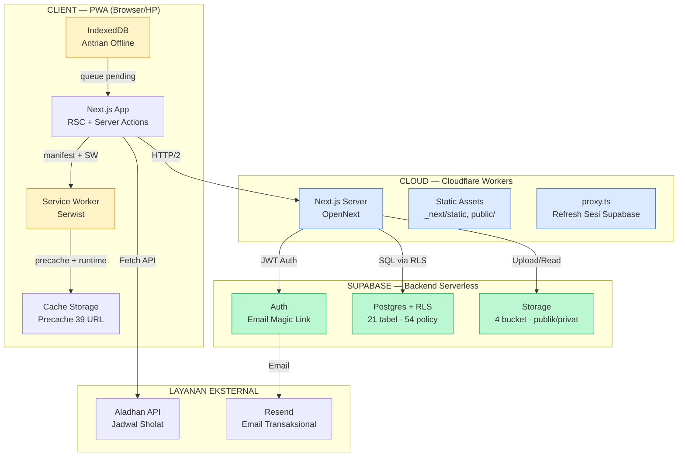
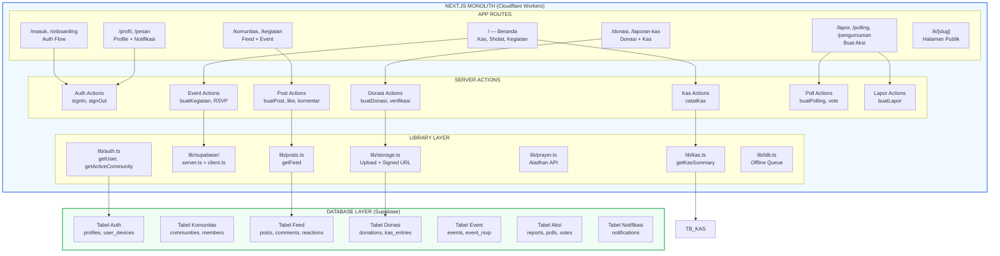
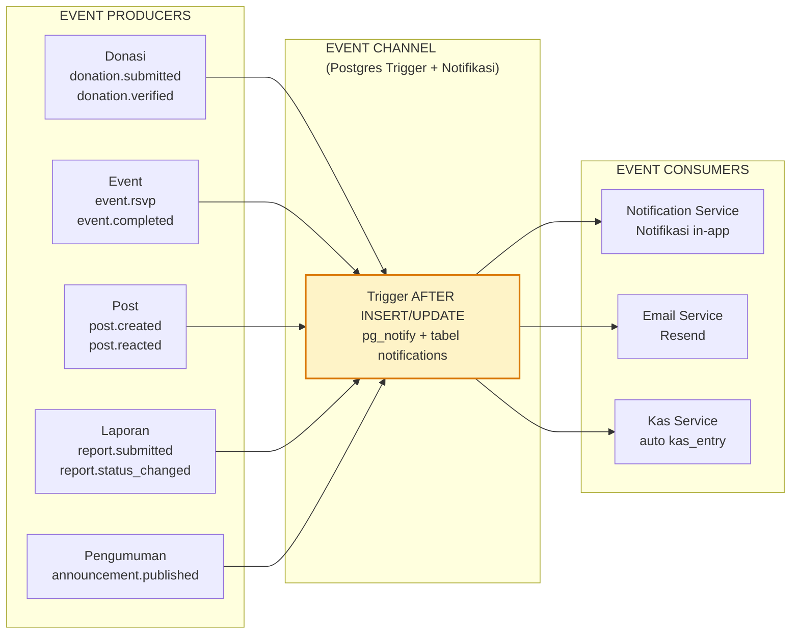
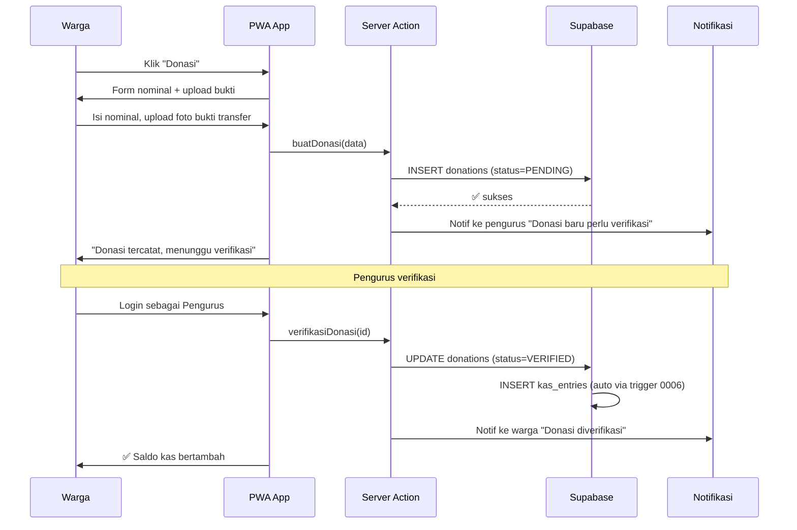
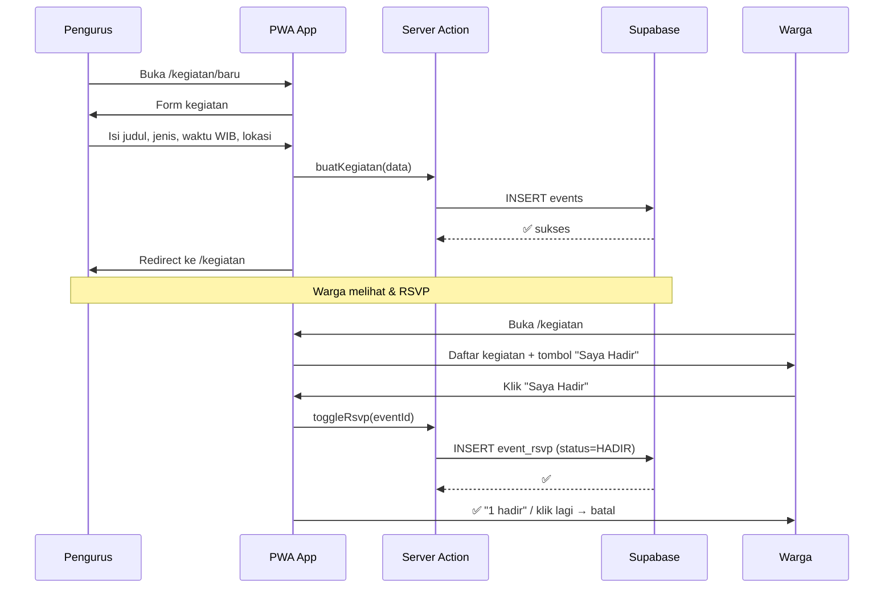
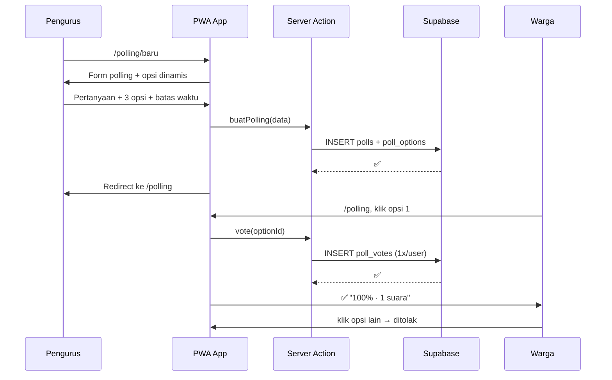
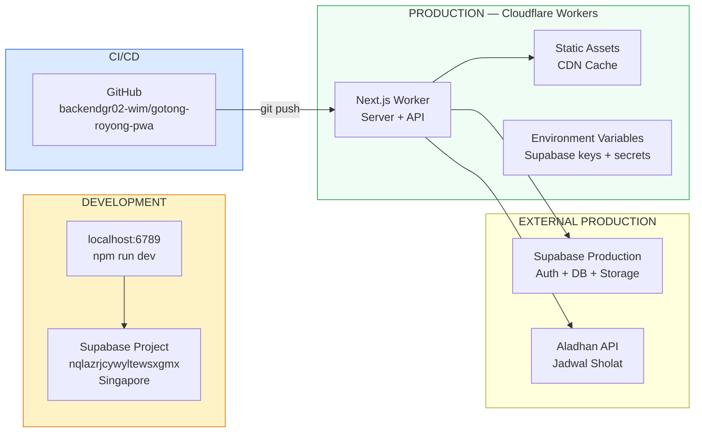

# 🏗️ ARSITEKTUR SISTEM — Gotong Royong PWA

**Standar:** C4 Model (Context → Container → Component → Code)
**Tujuan:** Menjembatani visi atasan (SuperApp enterprise) dengan realitas implementasi v1
**Status:** 22 Jun 2026 — v1 aktif, biaya operasional $0/bulan

---

## LEVEL 0 — VISI ARSITEKTUR (ATASAN)

Diagram ini adalah **visi 5 tahun** yang atasan ingin tuju. Semua item ditandai status
realitas kita saat ini.

**Legenda:**
- 🟩 **Hijau tebal** = sudah diimplementasikan di v1 (Community Service, Web App/PWA)
- ⬜ **Abu-abu putus-putus** = visi atasan, belum/tidak dibangun di v1 karena alasan biaya/scope

---

## LEVEL 1 — SYSTEM CONTEXT DIAGRAM

Apa yang user lihat dan sistem external yang terlibat.

**Catatan Context:**
- Tidak ada API Gateway terpisah — Next.js Server Actions + Supabase langsung
- Tidak ada Twilio — pakai magic link email (gratis)
- Tidak ada BI SNAP/QRIS — donasi via transfer manual + foto bukti
- Tidak ada BMKG/DINSOS — fitur kebencanaan & sosial diparkir ke Fase 3+

---

## LEVEL 2 — CONTAINER DIAGRAM

Arsitektur teknis implementasi v1.

### Detail Container

| Container | Teknologi | Fungsi |
|---|---|---|
| **Next.js App** | React 19 + Server Components | UI + Server Actions + data fetching |
| **Service Worker** | Serwist | Offline cache, navigation preload |
| **IndexedDB** | idb library | Antrian aksi saat offline |
| **Next.js Server** | OpenNext + Cloudflare Workers | Server-side rendering + Server Actions |
| **proxy.ts** | Next 16 middleware pattern | Refresh cookie sesi Supabase |
| **Postgres** | Supabase + RLS | 21 tabel, semua akses lewat RLS |
| **Auth** | Supabase Auth | Email magic link, sesi JWT |
| **Storage** | Supabase Storage | 4 bucket: publik & privat |

---

## LEVEL 3 — COMPONENT / SERVICE DIAGRAM

Domain bisnis di dalam monolith.

### Domain Map — Visi Atasan vs Implementasi Kita

| Domain Atasan | Implementasi Kita | Keterangan |
|---|---|---|
| **Auth Service** (M1) | `actions/auth.ts`, `lib/auth.ts`, `profil/` | ✅ Login magic link (bukan OTP Twilio) |
| **Community Service** (M2) | `actions/community.ts`, `actions/events.ts`, `/kegiatan/` | ✅ RSVP, member, event |
| **Donation Service** (M3) | `actions/donations.ts`, `actions/kas.ts`, `/donasi/` | ✅ Manual + bukti foto (bukan QRIS) |
| **Point & Voucher** (M4) | — | ❌ Parkir Fase 2 (ROADMAP) |
| **Admin Service** (M5) | Admin fitur menyatu di PWA | ⚠️ Dashboard khusus `/admin` rencana P5 |
| **AI Service** (M6) | — | ❌ Butuh budget GPU/API |
| **Disaster Service** (M7) | `actions/reports.ts`, `/lapor/` (terbatas) | ⚠️ Hanya lapor RT/RW, belum BMKG |
| **Social Service** (M8) | — | ❌ Parkir Fase 3+ |

---

## LEVEL 4 — EVENT FLOW DIAGRAM

Walaupun teknisnya menggunakan **Postgres trigger + notifikasi** (bukan Kafka),
kita dokumentasikan dengan nama event standar seperti arsitektur event-driven.

### Event Catalog Lengkap

| Event | Producer | Consumer | Trigger Source | Status |
|---|---|---|---|---|
| `post.created` | Post Action | Notif (anggota lain) | `0004` ✅ | Live |
| `post.reacted` | Post Action | Notif (penulis post) | `0004` ✅ | Live |
| `announcement.published` | Pengumuman Action | Notif (anggota lain) | `0004` ✅ | Live |
| `report.submitted` | Lapor Action | Notif (pengurus) | `0004` ✅ | Live |
| `report.status_changed` | Lapor Action | Notif (pelapor) | `0004` ✅ | Live |
| `donation.verified` | Donasi Action | Notif + auto kas_entry | `0006` ✅ | Live |
| `donation.submitted` | Donasi Action | Notif (pengurus) | `0006` ✅ | Live |
| `event.rsvp` | Event Action | — | 🔜 trigger baru | Planned |
| `event.completed` | Cron/Scheduler | — | 🔜 | Parkir |

### Perbandingan: Postgres Trigger vs Kafka

| Aspek | Kafka (Visi Atasan) | Postgres Trigger (Kita) |
|---|---|---|
| Biaya | $30-100+/bln (cluster) | **$0** (built-in Supabase) |
| Kompleksitas | Butuh运维 + monitoring | ✅ Satu setup, auto jalan |
| Skalabilitas | Jutaan event/detik | ✅ Cukup untuk puluhan ribu user |
| Durability | Disk + replikasi | ✅ Dalam transaksi yang sama |
| Observability | Kafka UI + metrics | ⚠️ Terbatas (bisa ditambah logging) |
| Multi-service | ✅ Wajib untuk microservices | ⚠️ Monolith tidak butuh |

**Keputusan:** Postgres trigger benar untuk v1. Migrasi ke Kafka hanya jika:
(1) monolith dipecah jadi microservices, ATAU (2) volume event > 10.000/hari.

---

## LEVEL 5 — DATABASE ERD

21 tabel dikelompokkan per domain visual.
Detail kolom di `src/db/schema.ts`.

```mermaid
erDiagram
    %% AUTH DOMAIN
    profiles {
        uuid id PK
        text full_name
        text phone
        text avatar_url
        timestamptz created_at
    }

    user_devices {
        uuid id PK
        uuid user_id FK
        text device_name
        text push_token
    }

    %% COMMUNITY DOMAIN
    communities {
        uuid id PK
        text name
        text slug UK
        text description
        text type
        text address
        jsonb metadata
    }

    memberships {
        uuid id PK
        uuid community_id FK
        uuid user_id FK
        text role
        text status
    }

    contacts {
        uuid id PK
        uuid community_id FK
        text label
        text value
    }

    %% EVENT DOMAIN
    events {
        uuid id PK
        uuid community_id FK
        text title
        text description
        timestamptz event_date
        text location
        text event_type
    }

    event_rsvp {
        uuid id PK
        uuid event_id FK
        uuid user_id FK
        text status
    }

    %% DONATION DOMAIN
    donations {
        uuid id PK
        uuid community_id FK
        uuid user_id FK
        bigint amount
        text proof_url
        text status
        uuid verified_by FK
    }

    kas_entries {
        uuid id PK
        uuid community_id FK
        text description
        bigint amount
        text type
        text hash_self
        text hash_prev
    }

    %% FEED DOMAIN
    announcements {
        uuid id PK
        uuid community_id FK
        uuid author_id FK
        text title
        text content
        boolean is_pinned
    }

    posts {
        uuid id PK
        uuid community_id FK
        uuid author_id FK
        text content
        text image_url
    }

    post_reactions {
        uuid id PK
        uuid post_id FK
        uuid user_id FK
        text emoji
    }

    post_comments {
        uuid id PK
        uuid post_id FK
        uuid author_id FK
        text content
    }

    %% REPORT DOMAIN
    reports {
        uuid id PK
        uuid community_id FK
        uuid user_id FK
        text title
        text description
        text image_url
        text latitude
        text longitude
        text status
    }

    %% POLL DOMAIN
    polls {
        uuid id PK
        uuid community_id FK
        uuid creator_id FK
        text question
        timestamptz expires_at
    }

    poll_options {
        uuid id PK
        uuid poll_id FK
        text label
    }

    poll_votes {
        uuid id PK
        uuid option_id FK
        uuid user_id FK
    }

    %% NOTIFICATION DOMAIN
    notifications {
        uuid id PK
        uuid user_id FK
        text title
        text body
        text link
        boolean dibaca
    }

    push_subscriptions {
        uuid id PK
        uuid user_id FK
        text endpoint
        jsonb keys
    }

    audit_log {
        uuid id PK
        uuid table_id
        text table_name
        text operation
        jsonb old_data
        jsonb new_data
    }

    %% IBADAH DOMAIN
    mutabaah_items {
        uuid id PK
        text name
        text icon
    }

    mutabaah_logs {
        uuid id PK
        uuid user_id FK
        uuid item_id FK
        date log_date
        boolean done
    }

    %% RELATIONS
    profiles ||--o{ user_devices : "has"
    profiles ||--o{ memberships : "has"
    communities ||--o{ memberships : "has"
    communities ||--o{ contacts : "has"
    communities ||--o{ events : "has"
    communities ||--o{ donations : "has"
    communities ||--o{ kas_entries : "has"
    communities ||--o{ announcements : "has"
    communities ||--o{ posts : "has"
    communities ||--o{ reports : "has"
    communities ||--o{ polls : "has"
    events ||--o{ event_rsvp : "has"
    posts ||--o{ post_reactions : "has"
    posts ||--o{ post_comments : "has"
    polls ||--o{ poll_options : "has"
    poll_options ||--o{ poll_votes : "has"
    profiles ||--o{ notifications : "receives"
    profiles ||--o{ mutabaah_logs : "logs"
    mutabaah_items ||--o{ mutabaah_logs : "tracked_by"
```

### Domain Clusters

| Cluster | Tabel | Keterangan |
|---|---|---|
| **Auth** | `profiles`, `user_devices` | Identitas & perangkat |
| **Community** | `communities`, `memberships`, `contacts` | Multi-tenant utama |
| **Event** | `events`, `event_rsvp` | Kegiatan & kehadiran |
| **Donation** | `donations`, `kas_entries` | Transparansi keuangan |
| **Feed** | `announcements`, `posts`, `post_reactions`, `post_comments` | Konten komunitas |
| **Report** | `reports` | Laporan RT/RW |
| **Poll** | `polls`, `poll_options`, `poll_votes` | Voting |
| **Notification** | `notifications`, `push_subscriptions` | Notifikasi in-app |
| **Audit** | `audit_log` | Riwayat perubahan |
| **Ibadah** | `mutabaah_items`, `mutabaah_logs` | Tracking ibadah harian |

**Catatan:** Semua tabel data punya kolom `community_id` untuk isolasi multi-tenant.
RLS (Row Level Security) aktif di 21/21 tabel — lihat `src/db/migrations/0001_auth_and_rls.sql`.

---

## ALUR END-TO-END UTAMA

### Alur Donasi (yang sudah jalan)

### Alur Kegiatan + RSVP (yang sudah jalan)

### Alur Polling (yang sudah jalan)

---

## DEPLOYMENT ARCHITECTURE

**Catatan Deployment:**
- **Vercel Hobby melanggar ToS untuk komersial** → kita pakai Cloudflare Workers (legal, gratis)
- **OpenNext** (`@opennextjs/cloudflare`) sebagai adapter Next.js → Workers
- **Supabase Production** = project yang sama (tidak ada separation dev/prod di free tier)
- **Keep-alive** diperlukan karena Supabase free "tidur" setelah 7 hari tidak aktif

---

## PERBANDINGAN: VISI ATASAN vs IMPLEMENTASI KITA

| Lapisan | Visi Atasan (Enterprise) | Implementasi Kita (v1) | Selisih |
|---|---|---|---|
| **Client** | Flutter + Web + Admin | **PWA saja** (installable) | Flutter = produk baru |
| **Gateway** | Kong/Cloudflare | **Next.js langsung** | Tidak perlu untuk monolith |
| **Auth** | Twilio OTP | **Magic link email (gratis)** | $0 vs $20-50/bln |
| **Payment** | QRIS/BI SNAP | **Transfer manual + foto** | Tanpa lisensi OJK |
| **AI** | Recommendation + Fraud | **Belum ada** | Butuh budget GPU |
| **Event Bus** | Kafka cluster | **Postgres trigger** | $0 vs $30-100+/bln |
| **Database** | 8 DB terpisah | **1 Supabase Postgres** | Cukup untuk 100rb user |
| **Deploy** | K8s cluster | **Cloudflare Workers** | $0 vs $50-200+/bln |
| **Biaya/bln** | $200-1000+ | **$0** | Klien cuma bayar domain |

---

## CARA MEMBACA DOKUMEN INI

1. **Atasan/Investor** → Mulai dari Level 0 (Visi) + Level 1 (Context)
2. **Developer** → Level 2 (Container) + Level 4 (Event Flow) + ERD
3. **DevOps** → Level 2 (Deployment) + Catatan Infrastruktur

---

## REFERENSI

- Kode: `src/db/schema.ts` (definisi tabel Drizzle), `src/db/migrations/` (SQL + RLS)
- Dokumentasi: `docs/PRD.md`, `docs/RENCANA_DATA.md`, `docs/DESIGN.md`, `docs/ROADMAP.md`
- Perbandingan visi: `docs/RESPON_ATASAN.md`
- Tracking: `docs/PERENCANAAN_V1.md`
- Aturan proyek: `AGENTS.md`

---

*Dokumen arsitektur C4 — 22 Jun 2026. Diagram Mermaid bisa di-import ke Excalidraw.*
